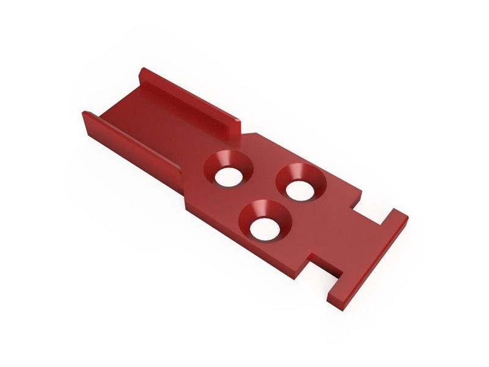

# Cable chain 10x11 spacer fix
## Credit
My own desing. 

## Print settings
As stated in the Voron documentation:
* ABS
* 0.2mm layer hight
* 0.4mm extrusion width
* 40% infill
* wall count 4
* top/bottom layers 5
* no supports

## Bom
Screws M3x8mm DIN 7991/ISO 10642 (standard screews are 6mm)

## Improvement
Spacer preventing bending in the wrong direction. Can be used with ziptie.

## Description
Fixing cable chain used in formbot kits. Easy to use and print, no need for superglue.

## Pictures

&nbsp; 

&nbsp; 

&nbsp; 
