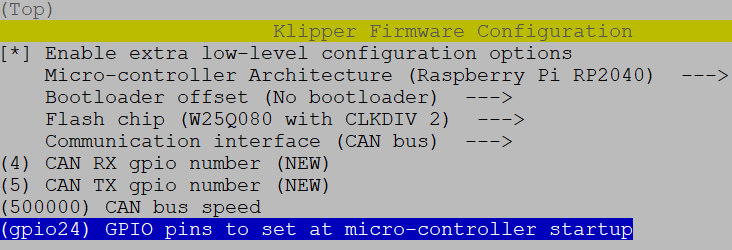

# CanBus, Canboot a jak na to

Jak nahrát Canboot a klipper do CanBus desky Mellow SB2040 v1

## 1. Canboot
Tento krok můžete přeskočit a není úplně nutný k plné funkčnosti, ale do budoucna je fajn pak mít možnost nahrát nový klipper firmware skrz CanBus interface, a nemusíte čarovat s USB kabelem

## 2. Klipper firmware
### Zkompilujeme klipper firmware

Vlezeme do klipper složky a stáhneme poslední aktualizaci z gitu:

    cd ~/klipper && git pull

odstraníme předešlé kompilace:

    make clean

provedeme nastavení pro co to kompilujeme:

    make menuconfig

nastavíme takto:

    

zmáčkneme q pro  uložení a y pro potvrzení

Zkompilujeme:

    make -j4

Teď nahrajeme námi zkompilovaný firmware do SB2040 desky:

Zmáčkneme tlačítko u USB-C na SB2040 a připojíme kabel.
Vypíšeme si usb zařízení:

    lsusb
mělo by se zobrazit toto:

    Bus 001 Device 014: ID 2e8a:0003

mělo by to vypsat toto:

    cd ~/klipper/
    make flash FLASH_DEVICE=2e8a:0003

## 3. Zapojení

