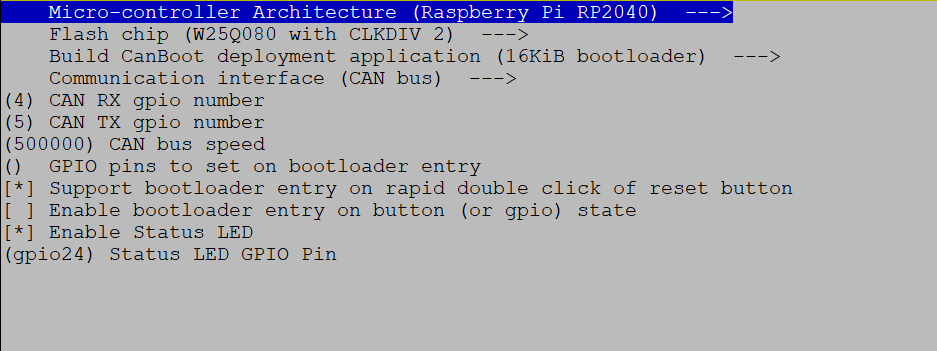
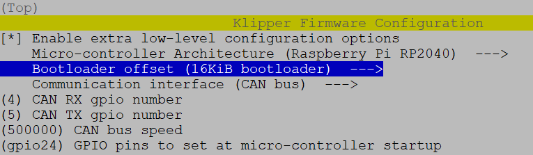
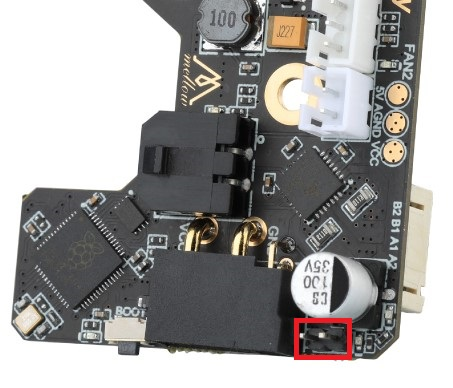
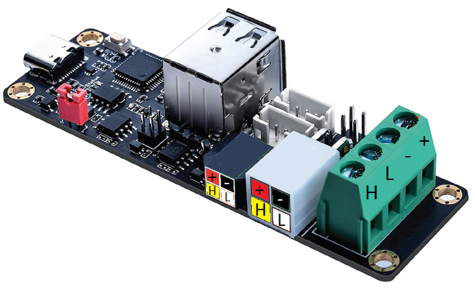
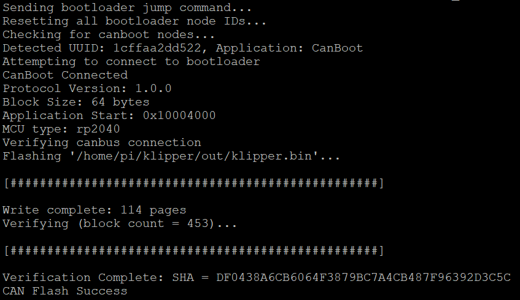
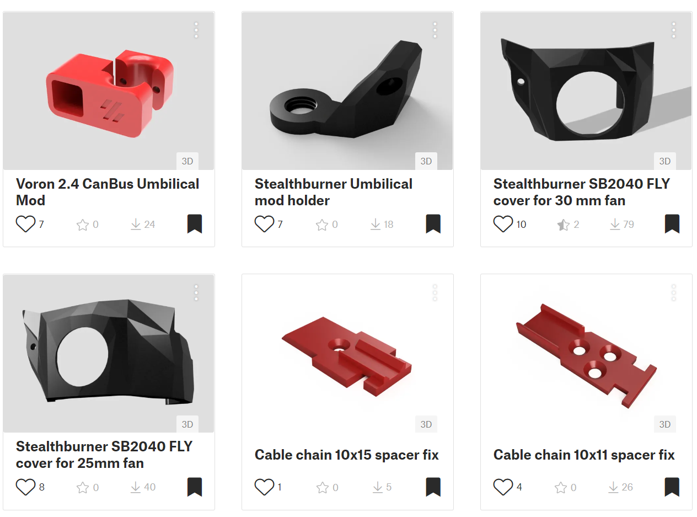

# CanBus, Canboot a jak to celé zprovoznit + něco navíc

Jak nahrát Canboot a klipper do CanBus desky Mellow SB2040 v1

 

# 1. Canboot
Tento krok můžete přeskočit a není úplně nutný k plné funkčnosti, ale do budoucna je fajn pak mít možnost nahrát nový klipper firmware skrz CanBus interface. **Nemusíte připojovat USB kabel do extruderu a nahrajete nový firmware jedním příkazem. Je to hodně pohodné.**

Tak jdem na to, připojíme se na ke své tiskárně pomocí SSH a vlezeme do své home složky:

    cd ~

Stáheneme poslední verzi CanBoot z gitu:

    git clone https://github.com/Arksine/CanBoot

Vlezeme do složky:

    cd CanBoot

  Odstraníme případné předešlé kompilace:

    make clean

Provedeme nastavení HW pro který to kompilujeme:

    make menuconfig

Nastavíme takto:  

 

### Zkompilujeme:

    make -j4

### Teď nahrajeme námi zkompilovaný CanBoot firmware do SB2040 desky:

Připojíme usb kabel do RPI, zmáčkneme tlačítko u USB-C na SB2040 a až pak připojíme USB kabel, pustíme tlačítko. Tímto bude SB2040 v DFU režimu a můžeme nahrát firmware skrz USB.
### Vypíšeme si usb zařízení:

    lsusb

Mělo by se zobrazit nově toto v seznamu:

    Bus 001 Device 014: ID 2e8a:0003

### Nahrajeme CanBoot firmware

    make flash FLASH_DEVICE=2e8a:0003

# 2. Klipper firmware
### Zkompilujeme firmware

Vlezeme do klipper složky a stáhneme poslední aktualizaci z gitu:

    cd ~/klipper && git pull

Odstraníme předešlé kompilace:

    make clean

Provedeme nastavení HW pro který to kompilujeme:

    make menuconfig

Nastavíme takto:

 

Nezapomeňte dopsat: rychlost **500000, nebo až 1000000 a gpio24**

Zmáčkneme **q** pro uložení a **y** pro potvrzení

### Zkompilujeme:

    make -j4

### Teď nahrajeme námi zkompilovaný firmware do SB2040 desky:

Připojíme usb kabel do RPI, zmáčkneme tlačítko u USB-C na SB2040 a až pak připojíme USB kabel, pustíme tlačítko.
### Vypíšeme si usb zařízení:

    lsusb

Mělo by se zobrazit toto:

    Bus 001 Device 014: ID 2e8a:0003

### Nahrajeme klipper firmware

    make flash FLASH_DEVICE=2e8a:0003

### Zkontrolujeme

    lsusb

a měli bychom vidět:

    Bus 001 Device 013: ID 1d50:614e OpenMoko, Inc.

Rozsvítí se status led:

# 3. Zapojení a nastavení canbus interfacu

## Zapojení
Ujistěte se, že jste na SB2040 zapojili jumper/propojku pro zakončovací odpor CANBUS 120 ohmů:

 Na FLY-UTOC-1 nedáváte žádné propojky.

> Zapojíte podle popisu pokud máte verzi jen s paticemi, pokud máte tu s microfit konektory tak takto podle barvy kabelů:
> - Červená +24V
> - Černá     0V
> - Žlutá   CanBus-H
> - Bílá    CanBus-L

 

## Vytvoření Canbus interface:

Doinstalujeme balíčky, které budeme potřebovat:

    sudo apt update && sudo apt install nano wget -y

Vyrobíme konfiguraci interfacu, kopírujte a vložte do konzole najednou a zmáčkněte Enter:

    sudo /bin/sh -c "cat > /etc/network/interfaces.d/can0" << EOF
    allow-hotplug can0
    iface can0 can static
        bitrate 500000
        up ifconfig \$IFACE txqueuelen 1024
    EOF

Automatické zapnutí CanBus interfacu při bootu RPI provedete příkazy:

    sudo wget https://cdn.mellow.klipper.cn/shell/can-enable -O /usr/bin/can-enable > /dev/null 2>&1 && sudo chmod +x /usr/bin/can-enable || echo "The operation failed"

    sudo cat /etc/rc.local | grep "exit 0" > /dev/null || sudo sed -i '$a\exit 0' /etc/rc.local

    sudo sed -i '/^exit\ 0$/i \can-enable -d can0 -b 500000 -t 1024' /etc/rc.local

Restartujeme RPI:

    sudo reboot

## Zjištění canbuss uuid

Zjistíme příkazem:

    python3 lib/canboot/flash_can.py -q

 Dostaneme odpověď:

    pi@Voron:~/klipper $ python3 lib/canboot/flash_can.py -q
    Resetting all bootloader node IDs...
    Checking for canboot nodes...
    Detected UUID: 211e59ecf887, Application: Klipper
    Query Complete

Zjištěné mé CanBus UUID je: **211e59ecf887** vaše bude jiné, to své si zkopírujte !!!!

# Konfigurace SB2040 v printer.cfg

 

Do printer.cfg si přidáme canbus mcu:

    [mcu sb2040]
    uuid: vase-id-napisete-sem     # vase uu id

    ## SB2040 RPI sensor
    [temperature_sensor FLY-SB2040]
    sensor_type: temperature_mcu
    sensor_mcu: sb2040

    ## SB2040 temperature sensor board
    [temperature_sensor SB-inside]
    sensor_type = ATC Semitec 104GT-2
    sensor_pin = sb2040:gpio26

    [controller_fan sb2040-fan]
    ##  SB2040 5V fan
    pin: sb2040:gpio15
    kick_start_time: 0.5  # full speed to spinn of fan
    fan_speed: 0.9 #reduce speed to 90%
    heater: heater_bed  # enabled when heater bed heating
    idle_timeout:30

    [adxl345]
    cs_pin: sb2040:gpio1
    spi_software_sclk_pin: sb2040:gpio0
    spi_software_mosi_pin: sb2040:gpio3
    spi_software_miso_pin: sb2040:gpio2

    [extruder]
    step_pin: sb2040:gpio9
    dir_pin: sb2040:gpio10
    enable_pin: !sb2040:gpio7
    rotation_distance: 22.6789511   #Bondtech 5mm Drive Gears

    gear_ratio: 50:10               #Gear Ratio Stealthburner
    microsteps: 32
    full_steps_per_rotation: 200    #200 for 1.8 degree, 400 for 0.9 degree
    nozzle_diameter: 0.400
    filament_diameter: 1.75
    heater_pin: sb2040:gpio6
    sensor_type: Generic 3950
    sensor_pin: sb2040:gpio27
    min_temp: 10
    max_temp: 280
    max_power: 1.0
    min_extrude_temp: 190
    max_extrude_cross_section: 50.0
    max_extrude_only_distance: 200
    pressure_advance: 0.04
    pressure_advance_smooth_time: 0.040

    [tmc2209 extruder]
    uart_pin: sb2040:gpio8
    interpolate: false
    run_current: 0.6
    sense_resistor: 0.110
    stealthchop_threshold: 0

    ########################################
    # Filament runout switch sensor
    ########################################

    [filament_switch_sensor runout_sensor]
    pause_on_runout: True
    runout_gcode:
    #SET_LED LED=toolhead RED=1 GREEN=0 BLUE=0 INDEX=1  TRANSMIT=1
    G91 ; relative positioning
    G1 E-2 F2700
    G1 Z10
    G90 ; absolute positioning
    G1 X250 Y50 F10000
    G91
    G1 E-100 F1000
    insert_gcode:
    #SET_LED LED=toolhead RED=0.5 GREEN=0.5 BLUE=0.0 WHITE=0.1 INDEX=1 TRANSMIT=1
    G92 E0 ; Reset Extruder
    G1 E50 F600 ; move filament down 50mm quickly
    G1 E60 F300 ; extrude 60mm of filament slowly to get it through nozzle
    event_delay: 3.0
    pause_delay: 0.5
    switch_pin: !sb2040:gpio29

    [probe] ## TAP
    pin: sb2040:gpio28
    x_offset: 0
    y_offset: 0
    #z_offset: 1
    speed: 3.0
    lift_speed: 7.0
    samples: 3
    samples_result: median
    sample_retract_dist: 2.0
    samples_tolerance: 0.006
    samples_tolerance_retries: 3
    activate_gcode:
    
    
    
    

    
        { action_respond_info('Extruder temperature target of %.1fC is too high, lowering to %.1fC' % (TARGET_TEMP, PROBE_TEMP)) }
        M109 S{ PROBE_TEMP }
    
        # Temperature target is already low enough, but nozzle may still be too hot.
        
            { action_respond_info('Extruder temperature %.1fC is still too high, waiting until below %.1fC' % (ACTUAL_TEMP, MAX_TEMP)) }
            TEMPERATURE_WAIT SENSOR=extruder MAXIMUM={ MAX_TEMP }
        
    

# Aktualizace SB2040 firmware skrz CanBus interface:

Postup je stejný jako v bodě 2:

## Zkompilujeme firmware

Vlezeme do klipper složky a stáhneme poslední aktualizaci z gitu:

    cd ~/klipper && git pull

Odstraníme předešlé kompilace:

    make clean

Provedeme nastavení HW pro který to kompilujeme:

    make menuconfig

Nastavíme takto:

 

Nezapomeňte dopsat: rychlost **500000, nebo až 1000000 a gpio24**

Zmáčkneme **q** pro uložení a **y** pro potvrzení

## Zkompilujeme:

    make -j4

Stopneme klipper

    sudo service klipper stop

### Teď nahrajeme námi zkompilovaný firmware do SB2040 desky:

    python3 ~/klipper/lib/canboot/flash_can.py -i can0 -f ~/klipper/out/klipper.bin -u 1cffaa2dd522

Mělo by to vypadat takto:

Opět spustíme klipper:

    sudo service klipper start 

# Něco navíc ... jak nahrát nový firmware do Octopuse bez otáčení tiskárny:

## Naformátujte nějakou malou microSD, naformátujte ji na FAT32 a strčte ji do Octopus desky

## Zkompilujte firmware pro svou desku jak jste zvykli

Stopneme klipper
    sudo service klipper stop

Ve složce kde máte klipper pak spustíme skript v mém případě pro F446 v1.1 verzi:

    ./scripts/flash-sdcard.sh /dev/ttyACM0 btt-octopus-f446-v1.1

Opět spustíme klipper:
    sudo service klipper start

**Teď jen vypněte celou tiskárnu skrz Mainsail, nebo Fluid, po nějaké chvilcevypnětěte tiskárnu úplně vypínačem, chvíli počkejte a opet zapněte, Octopus si automaticky nahraje nový klipper firmware z sd karty.**

Pokud máte jiný typ desky tak tímto příkazem vylistujeme a zjistíme zda to lze použít i s vaší deskou:

    ./scripts/flash-sdcard.sh -l

Pro tyto desky je zde podpora:

> - btt-gtr
> - btt-gtr-v1
> - btt-octopus-f407-v1
> - btt-octopus-f407-v1.0
> - btt-octopus-f407-v1.1
> - btt-octopus-f429-v1
> - btt-octopus-f429-v1.0
> - btt-octopus-f429-v1.1
> - btt-octopus-f446-v1
> - btt-octopus-f446-v1.0
> - btt-octopus-f446-v1.1
> - btt-octopus-pro-f429-v1.0
> - btt-octopus-pro-f446-v1.0
> - btt-skr-2-f407
> - btt-skr-2-f429
> - btt-skr-3
> - btt-skr-e3-dip
> - btt-skr-e3-turbo
> - btt-skr-mini
> - btt-skr-mini-e3-v1
> - btt-skr-mini-e3-v1.2
> - btt-skr-mini-e3-v2
> - btt-skr-mini-e3-v3
> - btt-skr-mini-mz
> - btt-skr-mini-v1.1
> - btt-skr-mini-v3
> - btt-skr-pro
> - btt-skr-pro-v1.1
> - btt-skr-pro-v1.2
> - btt-skr-se-bx
> - btt-skr-turbo-v1.4
> - btt-skr-v1.1
> - btt-skr-v1.3
> - btt-skr-v1.4
> - btt002-v1
> - creality-v4.2.2
> - creality-v4.2.7
> - fly-gemini-v2
> - flyboard-mini
> - fysetc-cheetah
> - fysetc-cheetah-v2
> - fysetc-s6-v1.2
> - fysetc-s6-v2
> - fysetc-spider
> - fysetc-spider-v1
> - generic-lpc1768
> - generic-lpc1769
> - mks-robin-e3
> - mks-robin-e3d
> - mks-sbase
> - mks-sgenl-v1
> - mks-sgenl-v2
> - monster8
> - robin_v3
> - smoothieboard-v1

# One more thing:
CanBus s Rpi SB2040 a řadičem motoru potřebuje chladit, hlavně pokud tisknete v uzavřeném boxu. Pro Stealthburner jsem upravil dvířka pro umístění ventilátoru 25x25x7 mm a 30x30x7 mm. Chladič krokového motoru je třeba upilovat zhruba na polovinu, pro jistotu přilepte i nějaký chladič na RP2040.

Modely naleznete zde: https://www.printables.com/cs/social/122655-locki/models

Pokud zde najdete nějakou blbost nepřesnost, typo atd tak napište na discordu, opravím.

